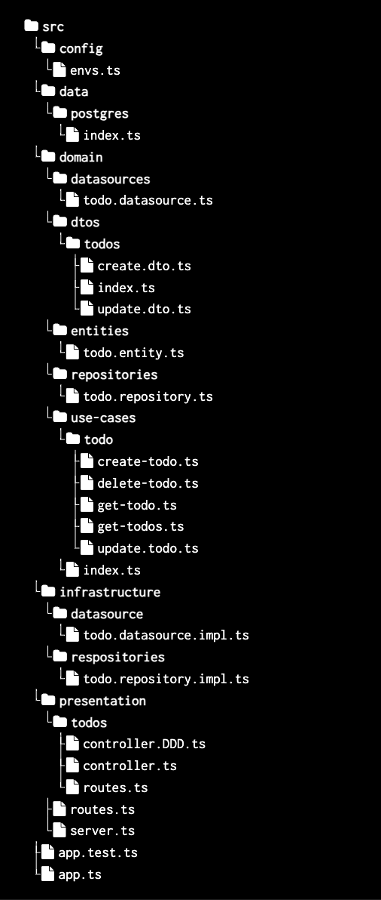
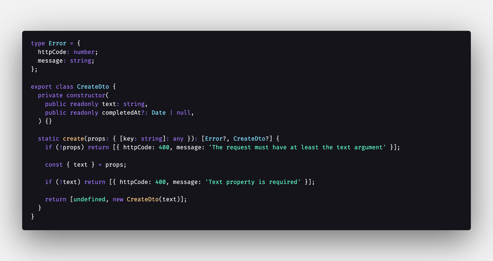
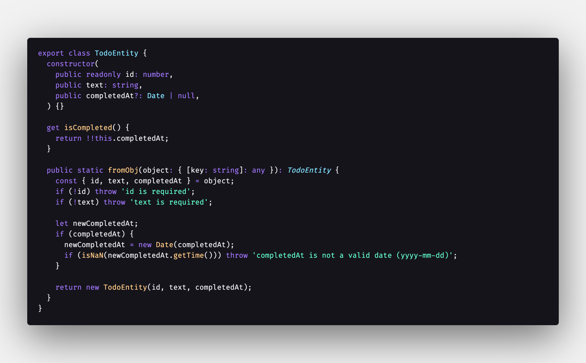
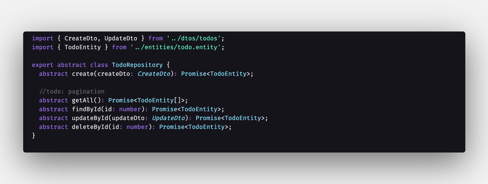

# Curso de node 

## Rest server - Arquitectura limpia

#### Proyecto creado para el curso de node contruyendo un rest server de tareas, empleando arquitectura limpia.

La **arquitectura limpia** (en inglés, *Clean Architecture*) es un enfoque de diseño de software propuesto por **Robert C. Martin** (también conocido como "Uncle Bob") que busca crear sistemas que sean:

- **Independientes del framework**
- **Fácilmente testeables**
- **Independientes de la base de datos**
- **Independientes de interfaces de usuario**
- **Independientes de agentes externos (como APIs de terceros)**

### ¿Cuál es la idea principal?

La idea central es **separar las responsabilidades** del sistema en capas bien definidas, de forma que el núcleo del negocio (la lógica pura) esté completamente aislado del resto del sistema. Así, si necesitas cambiar la base de datos, el framework web o la interfaz de usuario, puedes hacerlo sin afectar la lógica del negocio.

### 🧅 Capas de la Arquitectura Limpia (en forma de "cebolla"):

1. **Entidades (Entities)**
   - Son las reglas de negocio más generales.
   - Independientes de cualquier detalle externo.
2. **Casos de uso (Use Cases / Interactors)**
   - Aplican la lógica del negocio para cumplir con los requerimientos del sistema.
   - Orquestan el flujo entre entidades y servicios.
3. **Interfaces (Interface Adapters)**
   - Transforman datos entre los formatos usados por los casos de uso y los formatos usados por frameworks, bases de datos, APIs, etc.
   - Aquí pueden vivir controladores, presentadores, repositorios, DTOs, etc.
4. **Frameworks y drivers (Frameworks & Drivers)**
   - Todo lo externo: bases de datos, frameworks web (como Django, Flask, Spring), interfaces gráficas, etc.

### Principio de Dependencias

> "Las dependencias siempre apuntan hacia adentro."

Esto significa que el código de las capas externas **puede depender** del de las capas internas, pero **nunca al revés**. Por eso, por ejemplo, los casos de uso nunca deben importar clases de frameworks o bases de datos.

### Ventajas

- Alta **modularidad** y **mantenibilidad**
- Fácil de **testear** (unit testing)
- Bajo **acoplamiento**
- Alta **cohesión**
- Adaptable al cambio tecnológico

## Estructura de directorios

### Explicación de las capas

1. #### Domain

   **Qué son:**
    Interfaces que definen cómo se espera obtener los datos (por ejemplo, desde una base de datos, una API, etc.).

   **Para qué se usan:**
    Son contratos que luego serán implementados en capas como `infrastructure`.

   **Ejemplo:**

   

   > 🧠 *La capa domain no sabe si los datos vienen de PostgreSQL, Mongo, archivos o una API. Solo define el “qué”, no el “cómo”.*

2. #### **DTOs (Data Transfer Objects)**

   - **Qué son:**
      Estructuras de datos puras que definen la forma en que se recibe o envía información.

   - **Para qué se usan:**
      Aportan **tipado fuerte**, validación y separación clara entre el modelo de negocio (`Entity`) y los datos que entran/salen.

   - **Ejemplo:**

     

   > 💡 *No contienen lógica de negocio, solo estructura y validación de datos.*

3. **Entities**

   - **Qué son:**
      Representan el **modelo central del dominio**, con todas las reglas y propiedades que lo definen.

   - **Para qué se usan:**
      Contienen **reglas de negocio** internas que siempre deben cumplirse.

   - **Ejemplo:**

     

     

     > 🔐 *Las entidades son independientes de cómo se guardan o se presentan los datos.*

4. **Repositories**

   - **Qué son:**
      Interfaces que definen operaciones de alto nivel sobre entidades (CRUD, queries, etc.).

   - **Para qué se usan:**
     Desacoplan los **casos de uso** de la forma en que accedemos a los datos. Sirven como puente entre el dominio y la infraestructura.

   - **Ejemplo:**

     

     🧱 *Los repositorios trabajan con entidades, no con DTOs ni respuestas crudas de una base de datos.*

5. **Use Cases (Casos de Uso)**

   - **Qué son:**
      Lógica específica de aplicación: define **qué se puede hacer** con el sistema.

   - **Para qué se usan:**
      Orquestan los pasos para cumplir una acción concreta (crear, obtener, actualizar, eliminar, etc.).

   - **Ejemplo:**
      El caso `CreateTodo` puede:

     1. Validar el DTO.
     2. Crear una entidad.
     3. Llamar al repositorio para guardarla.
     4. Devolver el resultado.

     

     > > [!NOTE]
     > >
     > > 💼 *Los casos de uso no saben ni les importa cómo están implementados los repositorios.*

6. #### 🎯 Resumen visual rápido:

   DTOs           -> Definen los datos que entran/salen.
   Entities       -> Modelo del dominio con reglas propias.
   Repositories   -> Contrato para acceder a entidades.
   Datasources    -> Contrato para la fuente de datos.
   Use Cases      -> Aplican la lógica de negocio usando todo lo anterior.

   

   

   