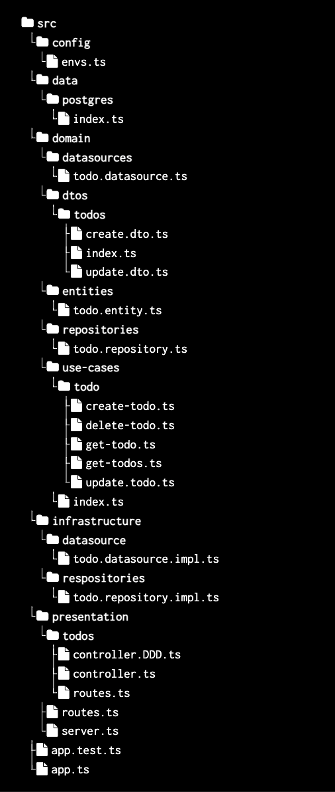

# Curso de node 

## Rest server - Arquitectura limpia

#### Proyecto creado para el curso de node contruyendo un rest server de tareas, empleando arquitectura limpia.

La **arquitectura limpia** (en inglés, *Clean Architecture*) es un enfoque de diseño de software propuesto por **Robert C. Martin** (también conocido como "Uncle Bob") que busca crear sistemas que sean:

- **Independientes del framework**
- **Fácilmente testeables**
- **Independientes de la base de datos**
- **Independientes de interfaces de usuario**
- **Independientes de agentes externos (como APIs de terceros)**

### ¿Cuál es la idea principal?

La idea central es **separar las responsabilidades** del sistema en capas bien definidas, de forma que el núcleo del negocio (la lógica pura) esté completamente aislado del resto del sistema. Así, si necesitas cambiar la base de datos, el framework web o la interfaz de usuario, puedes hacerlo sin afectar la lógica del negocio.

### 🧅 Capas de la Arquitectura Limpia (en forma de "cebolla"):

1. **Entidades (Entities)**
   - Son las reglas de negocio más generales.
   - Independientes de cualquier detalle externo.
2. **Casos de uso (Use Cases / Interactors)**
   - Aplican la lógica del negocio para cumplir con los requerimientos del sistema.
   - Orquestan el flujo entre entidades y servicios.
3. **Interfaces (Interface Adapters)**
   - Transforman datos entre los formatos usados por los casos de uso y los formatos usados por frameworks, bases de datos, APIs, etc.
   - Aquí pueden vivir controladores, presentadores, repositorios, DTOs, etc.
4. **Frameworks y drivers (Frameworks & Drivers)**
   - Todo lo externo: bases de datos, frameworks web (como Django, Flask, Spring), interfaces gráficas, etc.

### Principio de Dependencias

> "Las dependencias siempre apuntan hacia adentro."

Esto significa que el código de las capas externas **puede depender** del de las capas internas, pero **nunca al revés**. Por eso, por ejemplo, los casos de uso nunca deben importar clases de frameworks o bases de datos.

### Ventajas

- Alta **modularidad** y **mantenibilidad**
- Fácil de **testear** (unit testing)
- Bajo **acoplamiento**
- Alta **cohesión**
- Adaptable al cambio tecnológico

## Estructura de directorios

